# SimpleCTF

---

Iniciamos la maquina usando la VPN de TryHackMe

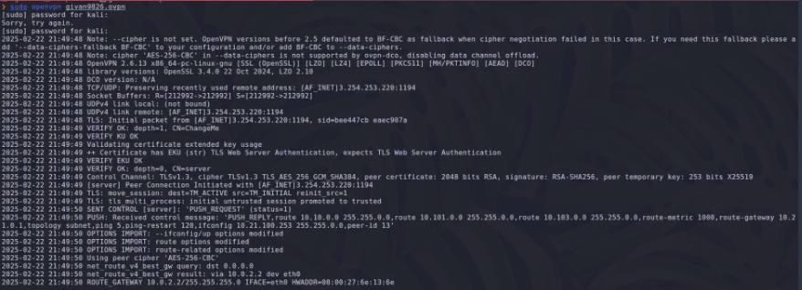

## Reconocimiento

Una vez conectados a la maquina realizamos un escaneo con nmap 

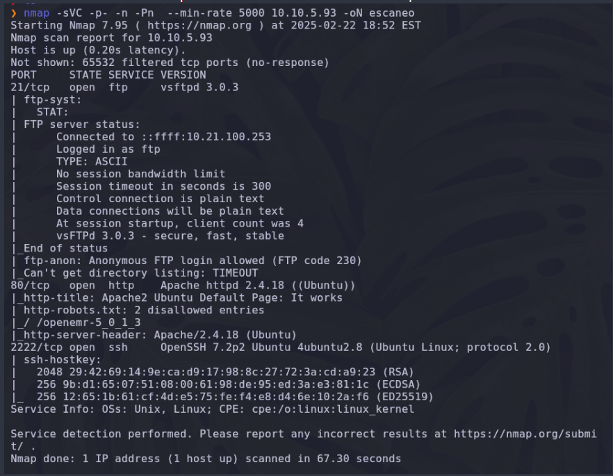

### Respuesta 1

Sabemos que tenemos 2 puertos por debajo del puerto 1000

- ftp (port 21) y 80 (http)

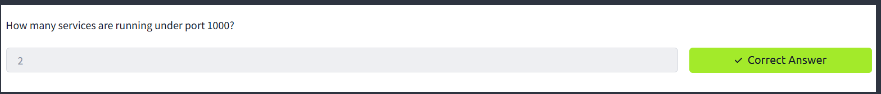

### Respuesta 2

 El servicio que corre en el puerto mas alto es ssh 

 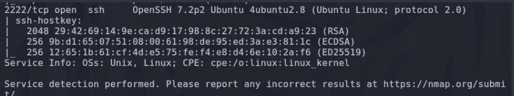

 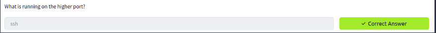

 ### Respuesta 3

 Haciendo un fuzzing web con dirb http://10.10.5.93 nos sale como un directorio 10.10.5.93/simple/
Accediendo a la web podemos ver que tenemos una versión de CMS 2.2.8 

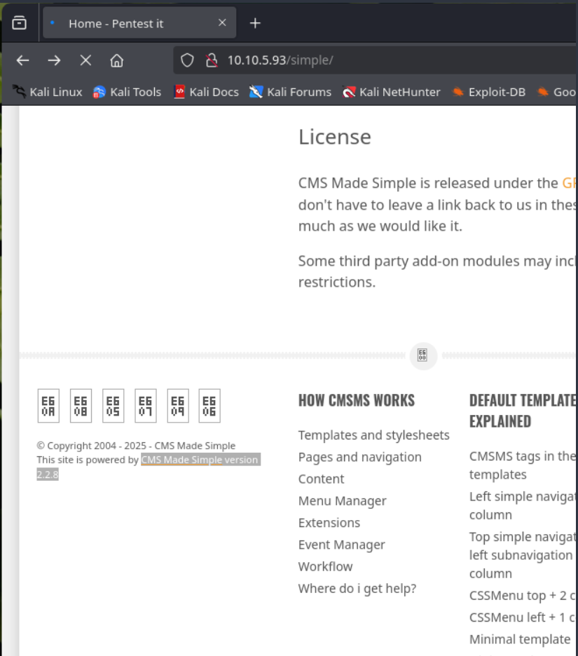

Buscamos esa version de CMS en Database 

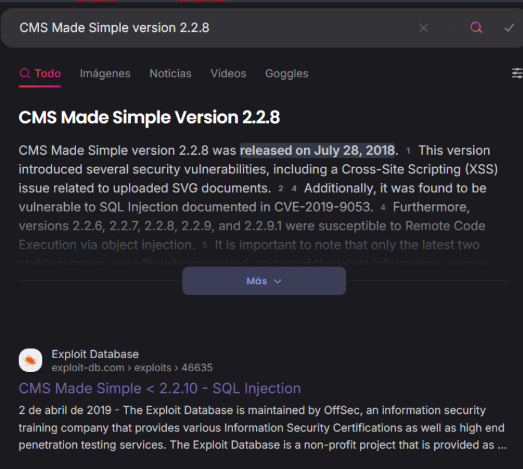

En los detalles del CVE sabemos que el codigo de CVE es 2019-9053

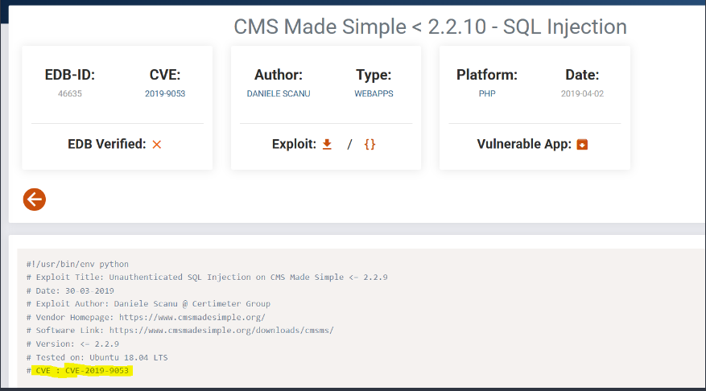

Descargamos el CVE 

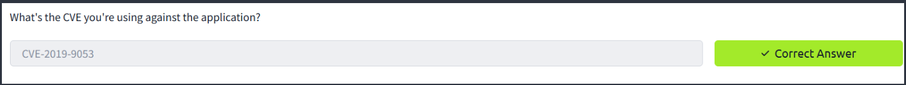

### Respuesta 4

En el titulo del CVE  sabemos que es vulnerable a SQL injection 
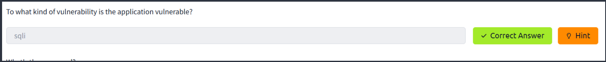

### Respuesta 5

Utilizando searchsploit buscamos un exploit para ejecutar y sabemos que tenemos un exploit en el directorio /usr/share/exploitdb/exploits/php/webapps/46635.py asi que lo copiamos en nuestra carpeta local con el nombre de cmsexploit.py
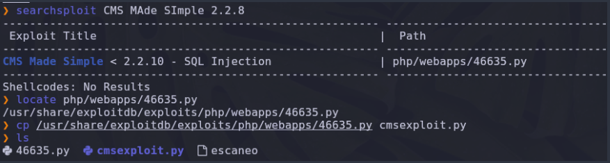

Al ejecutarlo utilizando python2 obtenemos un error del modulo termocolor
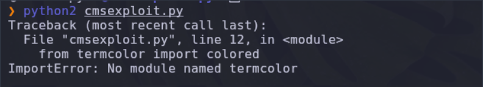

Asi que para instalar termcolor primero debemos instalar pip para python2
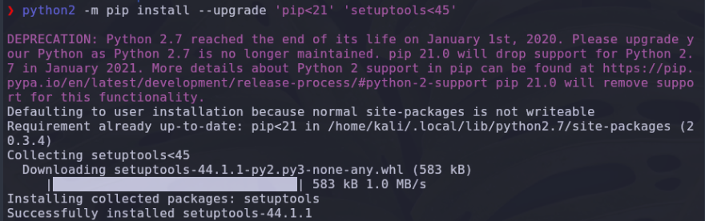

Una vez instalado pip instalamos termcolor 
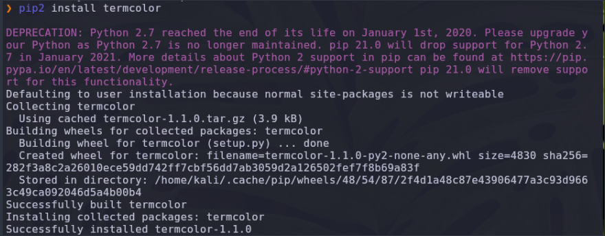

Hacemos la prueba de que termcolor funciona correctamente 

Ahora ejecutamos el exploit para obtener el usuario y contraseña utilizando el exploit 
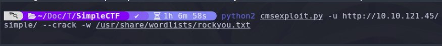

 ### Respuesta 6

 Los usuarios y contraseña los obtenemos 

 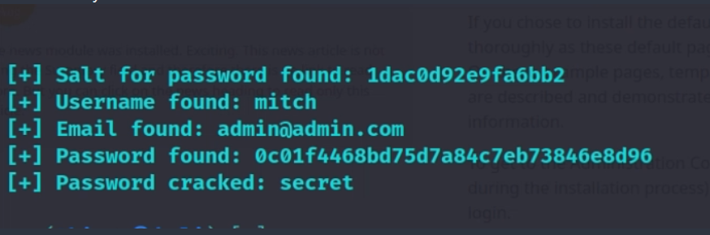

### Respuesta 7

Sabemos que una manera de acceder a la maquina es por ssh el cual es un servicio que ==No corre en el port 22== si no en el 2222

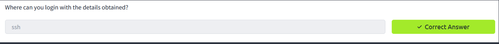

### Respuesta 8

Accedemos utilizando ssh con el usuario y contraseña que obtuvimos
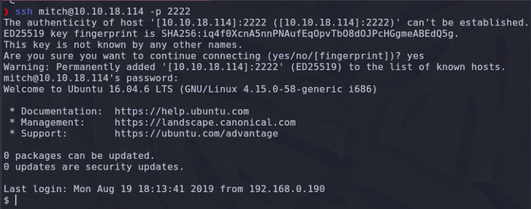

### Respuesta 9

Una vez accedemos como el usuario mitch hacemos un `ls` y posteriormente leemos el archivo user.txt con `cat` el cual tiene nuestra user flag 

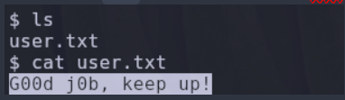

### Respuesta 10

Hacemos un `cd ..` para ir al directorio home y sabemos que existe otro usuario llamado *sunbath*

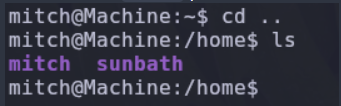

### Respuesta 11

Ejecutamos un sudo -l para averiguar si podemos ejecutar algún binario como root o como sunbath.
Asi que vemos que se puede ejecutar como root el binario vim

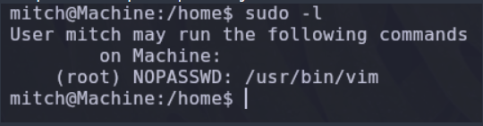

### Respuesta 12

Para hacer el pivoting hacia el usuario root usamos la web de GTFObins y buscamos el binario vim.
Utilizamos el comando encontrado en GTFObins

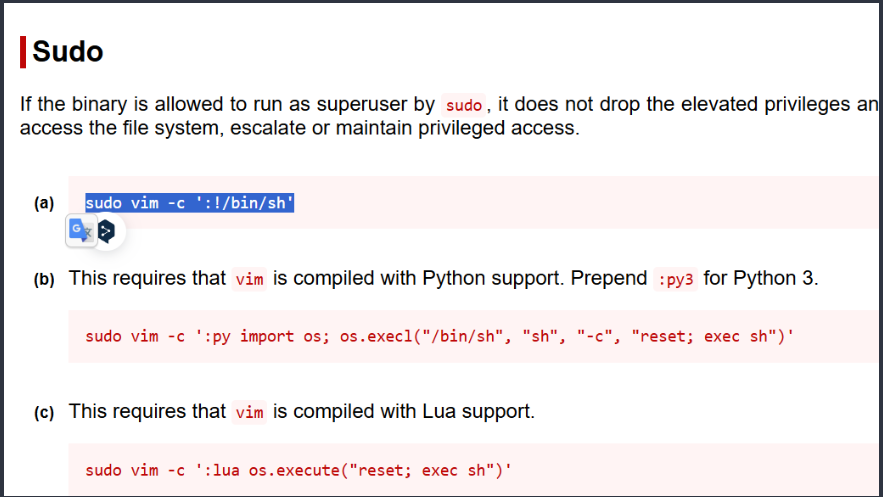

Nos regresa una shell y ahora somos root 

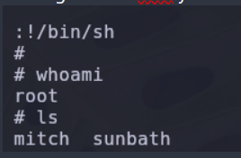

### Respuesta 13

En el directorio /root/root.txt esta la root flag asi que la leemos con cat 

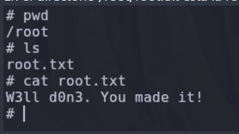

