# TomGhost
---

## Reconocimiento

Realizamos una escaneo con nmap 

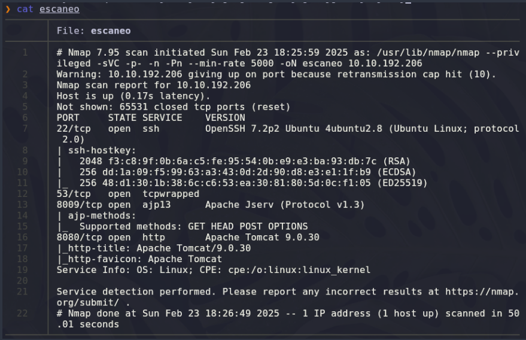

Tenemos el puerto 22,53,8009 y 8080 para http asi que ponemos la dirección IP en el navegador y vemos la siguiente pagina

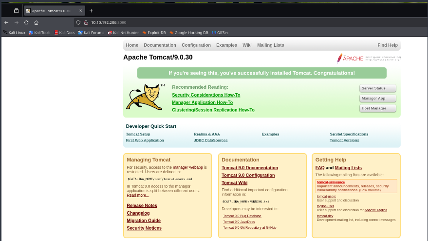

Realizamos un fuzzing usando *gobuster* pero no vemos nada interesante 
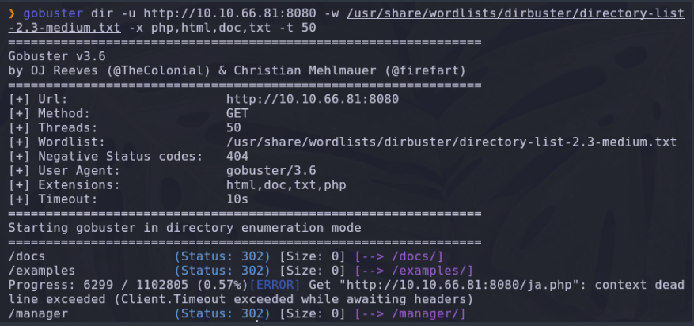

Dado que no vemos nada interesante en el fuzzing recordamos que tenemos un servicio ajp13 en el puerto 8009,asi que utilizando `searchsploit` buscamos un exploit que nos pueda funcionar 
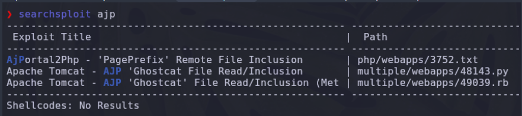

Con ayuda de locate ubicamos el exploit y lo copiamos en nuestra carpeta local de la maquina de TomGhost
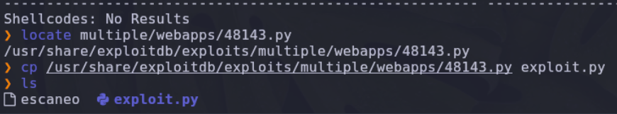

Una vez creado lo ejecutamos para saber que parámetros necesitamos colocar 
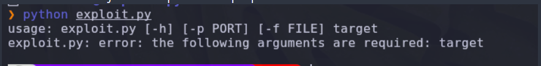

Hacemos una búsqueda en la web de ajp13 y sabemos que vulnera el directorio siguiente 
/WEB-INF/web.xml
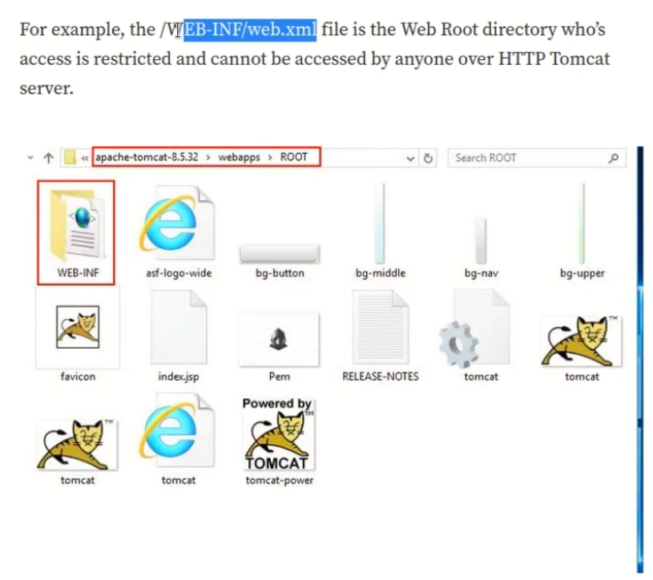

Ahora que sabemos los parametros que necesitamos ejecutamos el exploit
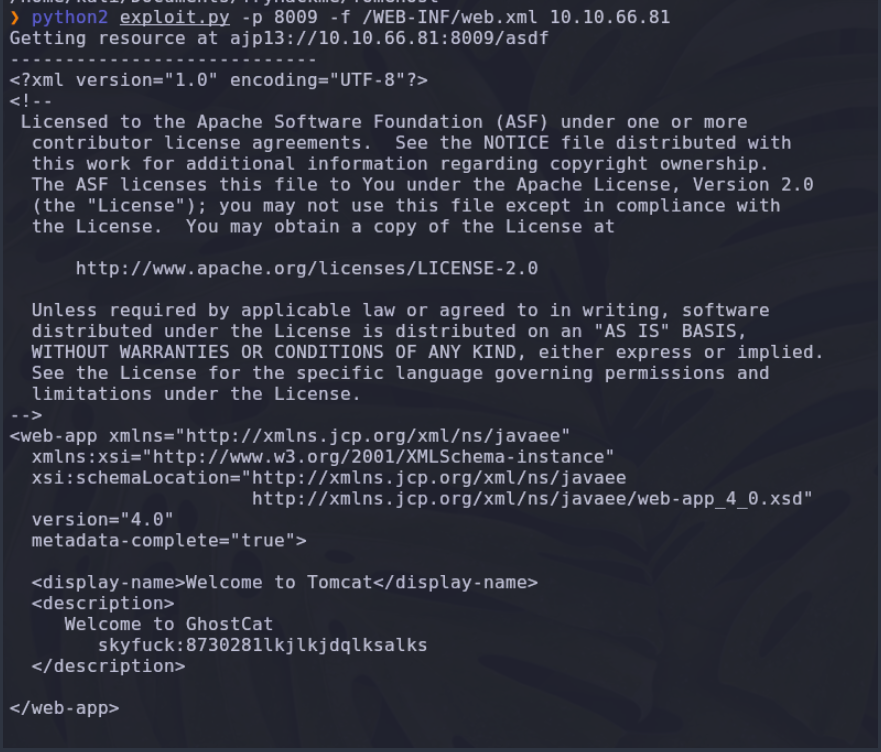

El script nos muestra un usuario y una password
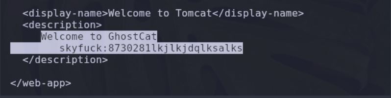

### Respuesta 1

Sabemos que la maquina tiene abierto el puerto ssh asi que utilizamos el user y password que encontramos anteriormente para conectarnos a la maquina 

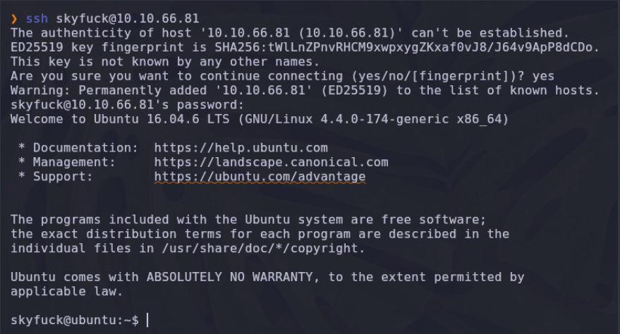

Una vez dentro ejecutamos nos vamos al directorio home y ejecutamos el comando ls para listar el contenido.
Podemos ver que tenemos dos usuarios *merlin* y *skyfuck* asi que haremos el intento de cambiarnos al directorio del usuario *merlin*
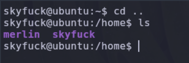

Nos cambiamos exitosamente al directorio de *merlin*, listamos el contenido y podemos ver la primera flag 
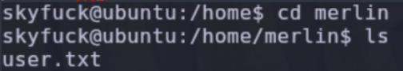

---

### Respuesta 2

Regresando al directorio de *skyfuck* si listamos podemos ver que existen 2 archivos .pgp y .asc,los cuales son archivos encriptados 

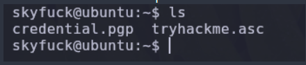

Para estos archivos utilizaremos nuestra maquina local atacante por lo que tenemos que descargarlos en nuestra maquina.
Necesitamos levantar un servidor desde la maquina victima con python 

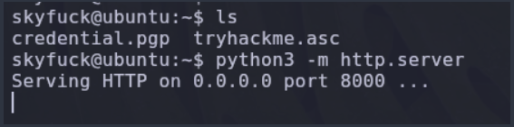

En nuestra maquina atacante obtenemos los dos archivos utilizando `wget` 
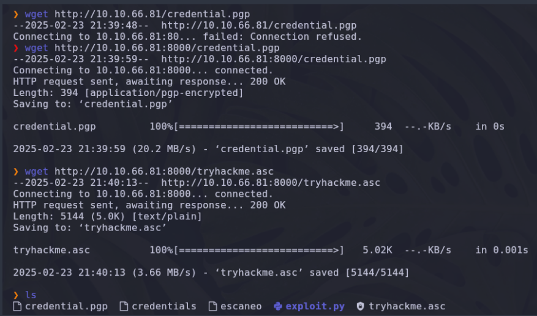

Una vez que tenemos  los archivos  ejecutamos el comando `pgp --decrypt credential` por lo que nos arroja la siguiente ventana 
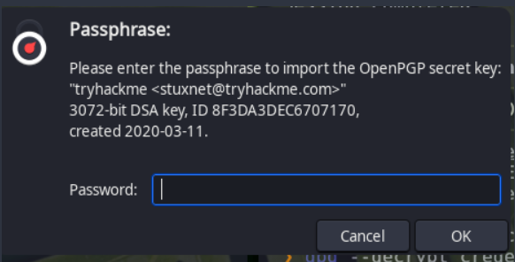

Es necesaria una contraseña para desencriptar el archivo asi que utilizaremos la herramienta de *john* para desencriptar 

Primero debemos  convertir el archivo para que pueda ser leido por jhon 
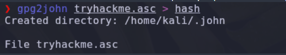

Una vez creado el archivo hash utilizamos *john* para desencriptar 
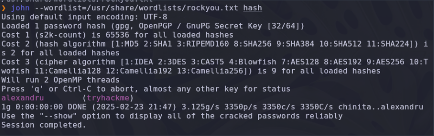

Ahora importamos la clave privada *tryhackme.asc* y nos solicitará la contraseña anteriormente encontrada 
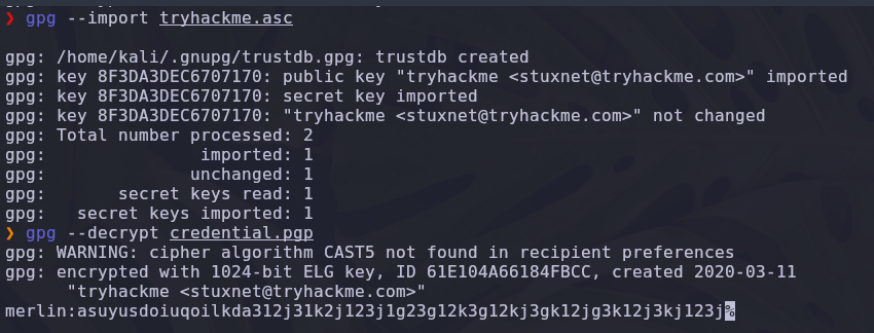

Obtenemos la contraseña para el usuario *merlin* 

Cambiamos al usuario *merlin* y colocamos la contraseña que anteriormente encontramos 
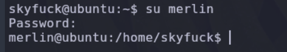

Ejecutamos el comando `sudo -l` para saber si podemos ejecutar algun binario como root
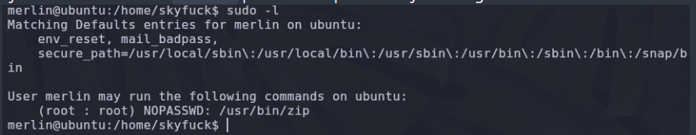

Sabemos que zip lo podemos ejecutar como *root* sin contraseña asi que buscamos en GTFObins el binario y el comando para ejecutar y convertirnos en *root*
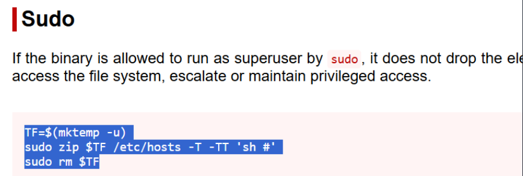

Ejecutamos los comandos para convertirnos en root y lo logramos 
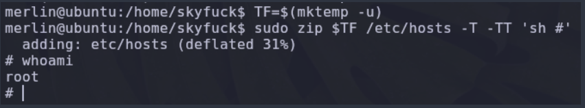

Obtenemos la flag para el usuario root

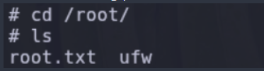

#                               P W N E D !

