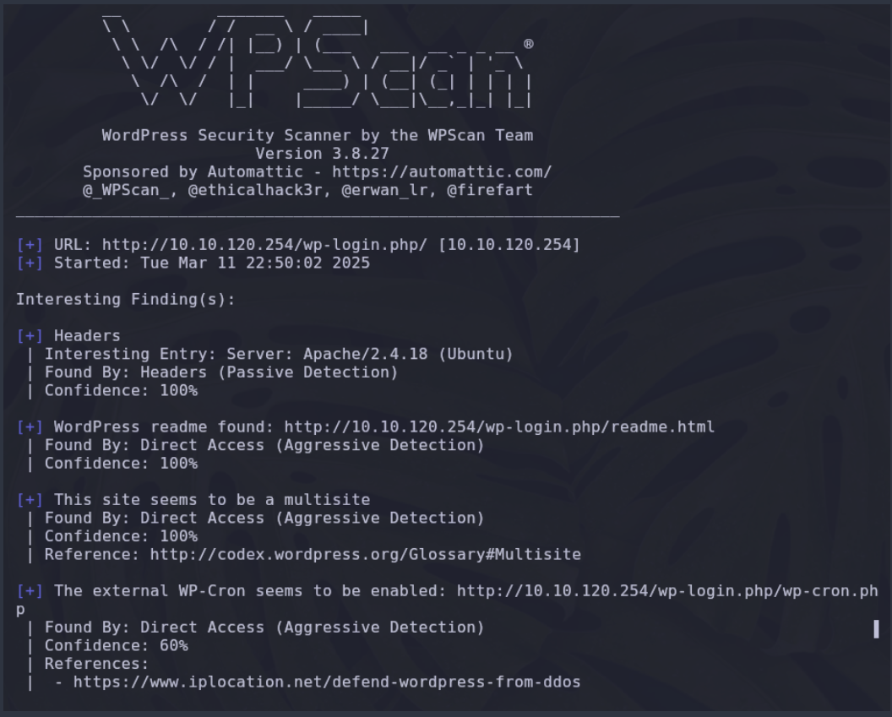
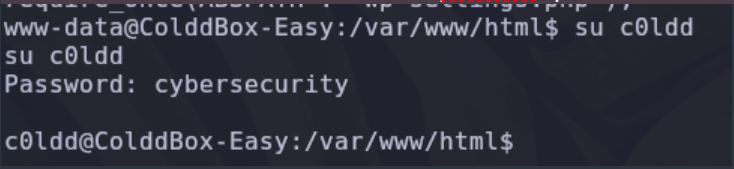

# Escaneo 
### Realizamos un escaneo utilizando nmap 

En los resultados del escaneo sabemos que los puertos 80 y 4512 están abiertos, asi que colocamos la dirección IP en el navegador para acceder a la pagina que almacena

No encontramos nada interesante por lo que hacemos escaneo de directorios 

Encontramos algunos directorios interesantes como wp-admin y wp-content asi que usaremos la herramienta WPScan para escanear el WordPress
enumeramos utilizando 
- `-e u para enumerar usuarios`

Encontramos interesante que existen 3 usuarios 
- c0ldd
- hugo
- philip

Utilizando el directorio accedemos con la ip/wp-login.php para colocar el usuario y contraseñas 

Ahora volvemos a enumerar ahora con el directorio /wp-login.php y hacemos la prueba utilizando la wordlist y el usuario *c0ldd*

Obtenemos la contraseña para el usuario c0ldd 

Con el usuario c0ldd y la password que encontramos accedemos en login de wordpress

Entramos al panel de de administración de wordpress

Entramos a apperance > Editor > 404 template  y vemos que existe una sección donde podemos insertar codigo para ejecutar 

En nuestra terminal de la maquina atacante buscamos una reverse-shell 

Copiamos la reverse a nuestro directorio local que creamos para la maquina 

Editamos el código php con nuestra IP y el puerto 4444

Una vez hayamos editado el código copiamos el contenido del archivo shell.php al portapapeles

Pegamos el código en la sección de wordpress que vimos anteriormente 

Para ejecutar el código que subimos primero debemos ponernos a la escucha utilizando netcat

Ejecutamos el código utilizando el siguiente directorio que es donde se sube el código que pegamos 

Una vez lo ejecutamos nos devuelve acceso a la maquina vulnerable 

Una vez dentro de la maquina listamos el contenido 

Dentro de home/c0ldd sabemos que existe el archivo user.txt pero con el usuario que somos (www-data) no podemos leer el contenido.
Es necesario ser usuario *c0ldd*

Sabemos que archivos de configuración muy comúnmente están guardados en el directorio `/var/www/html` donde existe el archivo  `wp-settings.php`.
Leemos el contenido y encontramos la password de c0ldd

Cambiamos al usuario *c0ldd* utilizando la password que encontramos

Una vez que somos el usuario c0ldd nos ubicamos dentro del directorio del usuario c0ldd y listamos el contenido.

Ahora si podemos leer el contenido de la user.txt

Para hacer la escalada de privilegios a root ejecutamos el comando sudo -l

Podemos ejecutar el binario ftp para escalar privilegios por lo que utilizando la web de GTFObins buscamos el comando para ftp

Ejecutamos el comando para escalar privilegios y somos root

Listamos el contenido en el directorio root y encontramos la root.txt

